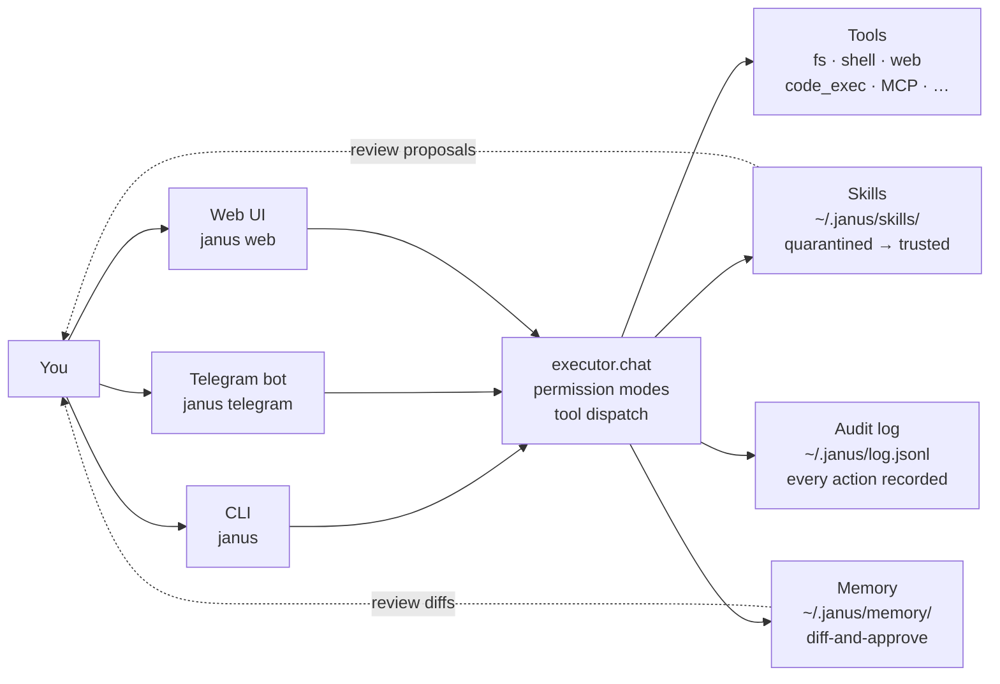

<div align="center">


<br>

[](https://pypi.org/project/janus-agent/)
[](https://www.python.org/downloads/)
[](LICENSE)
[](https://github.com/samalgotrader7-ops/janus/pkgs/container/janus)

**A self-improving AI agent for developers.**
**Plain-text state · three gateways · any OpenAI-compatible model.**

</div>

---

## What is Janus

Janus is a **self-improving AI agent for developers**. It learns
from how you use it: noticing repeated patterns, proposing new
skills you review and accept, evolving a memory of your
preferences and projects over time.

State lives as **plain-text markdown** — auditable, hackable,
syncable across devices. **Three gateways** (CLI, Telegram, Web)
share one brain. Bring your own model from any OpenAI-compatible
provider (Anthropic, OpenAI, OpenRouter, Ollama, llama.cpp, …).

> Janus is not a SaaS product. It runs on your hardware. Your
> conversations, memory, and skills never leave your machine
> unless you explicitly send them somewhere.

---

## 60-second quickstart

```bash
# 1. Install (Linux / macOS — requires Python 3.10+)
pipx install janus-agent

# 2. Configure (interactive — picks up existing OPENAI_API_KEY etc.)
janus onboard

# 3. Chat
janus
```

That's it. You'll see a streaming chat with inline tool calls and a
permission prompt for any side effect.

> **Want a deeper walkthrough?** Four progressive tutorials in
> [`tutorials/`](tutorials/) cover skills, memory, and MCP
> integration — each one screenful, ~10 minutes each.

> **Want to deploy on a VPS?**
> [`scripts/install_services.sh`](scripts/install_services.sh)
> installs systemd units for `telegram` + `web` + `daemon` with
> auto-restart on `git pull`.

---

## How it works



**One agent loop. Three surfaces talk to it. State on disk you
can read.**

---

## Why Janus

|  | Janus | Typical agent CLI |
|---|---|---|
| **Model** | Any OpenAI-compatible (Anthropic, OpenAI, OpenRouter, Ollama, …) | Provider-locked |
| **State** | Plain text under `~/.janus/` (cat, grep, git) | Opaque database |
| **Skills** | Markdown files; quarantined → user `/promote`s | None or auto-evolve |
| **Memory** | Diff-and-approve; user controls every save | Opaque embeddings |
| **Audit** | Every turn → `~/.janus/log.jsonl`, FTS5-indexed | Best-effort |
| **Gateways** | CLI + Telegram + Web sharing one state | CLI only |
| **Deploy** | systemd / Docker / PyPI / git+URL | varies |
| **Self-host** | Always | Sometimes |

---

## Features

- **Self-improving learning loop**
  - Skills auto-proposed from repeated patterns; you review + promote.
  - Memory diffs proposed after each turn; you accept / reject / edit.
- **Multi-surface**
  - `janus` — terminal chat with streaming, tool inline, slash commands
  - `janus telegram` — bot gateway with inline plan-review keyboards
  - `janus web` — local FastAPI UI with cost charts, MCP browser, skills panel
  - `janus daemon` — runs scheduled agents (cron-style triggers)
- **Plain-text everything**
  - Memory: markdown cards under `~/.janus/memory/`
  - Conversations: JSON files under `~/.janus/conversations/`
  - Skills: markdown + YAML frontmatter under `~/.janus/skills/`
  - Audit: JSONL log under `~/.janus/log.jsonl` + `audit.jsonl`
- **Permission modes** — `default` / `acceptEdits` / `plan` / `bypassPermissions`. Set with `/mode` or `JANUS_APPROVAL` env.
- **MCP integration** — connect any stdio Model Context Protocol server (filesystem, git, sqlite, fetch, …). Browse the catalog with `/mcp catalog`.
- **Production-ready**
  - systemd integration: `janus service install/enable/status`
  - Reverse-proxy generators: `janus web config caddy|nginx`
  - Rate limiting on public endpoints (token-bucket per IP)
  - Backup / restore: `janus backup` / `janus restore`
  - Health endpoint: `GET /api/health`
  - Audit log: `janus audit --action skill.promote`
- **Cross-device memory sync** — `janus sync push|pull` (git-backed; bring your own remote)
- **Webhooks** — `POST /api/webhook/<key>` with HMAC-SHA256 fires the agent from any external service
- **Image generation** — built-in `image_gen` tool (DALL-E / Stable Diffusion via OpenAI-compatible endpoints)
- **Cost tracking** — `/cost` shows token usage + budget alerts at 50/80/100%

---

## Install

### Easiest — PyPI

```bash
pipx install janus-agent
```

For all gateways (Telegram + Web + headless browser tools):

```bash
pipx install 'janus-agent[all]'
```

### One-line installer (auto-detects platform)

```bash
curl -sSL https://raw.githubusercontent.com/samalgotrader7-ops/janus/main/scripts/install.sh | sh
```

### Docker

```bash
# Standalone web UI
docker run --rm -it -p 8765:8765 \
  -v janus-data:/root/.janus \
  --env-file .env \
  ghcr.io/samalgotrader7-ops/janus:latest web

# Three-service stack (web + telegram + daemon)
git clone https://github.com/samalgotrader7-ops/janus.git
cd janus
cp .env.example .env  # fill in your keys
docker compose up -d
```

### From source

```bash
git clone https://github.com/samalgotrader7-ops/janus.git
cd janus
pipx install -e '.[all]'
```

---

## Configure

Janus needs three env vars: an API key, an API base URL, and a model id.

The fastest path:

```bash
janus onboard
```

The interactive wizard walks you through provider selection
(OpenRouter, OpenAI, Anthropic, Ollama, …) and picks up
existing `OPENAI_API_KEY` / `ANTHROPIC_API_KEY` /
`OPENROUTER_API_KEY` from your shell automatically.

Or set directly:

```bash
export JANUS_API_KEY="sk-..."
export JANUS_API_BASE="https://openrouter.ai/api/v1"
export JANUS_MODEL="anthropic/claude-haiku-4-5"
```

Persist these to `~/.janus/.env` so they survive shell restarts.

---

## Tutorials

Four progressive walkthroughs in [`tutorials/`](tutorials/), each
one screenful (~10 minutes each):

1. **[Hello, Janus](tutorials/01-hello-janus.md)** — install,
   configure a model, first turn.
2. **[Your First Skill](tutorials/02-your-first-skill.md)** — write
   a skill, see it auto-load, `/promote` it.
3. **[Memory Loop](tutorials/03-memory-loop.md)** — memory
   proposals, review, hygiene.
4. **[Connect MCP](tutorials/04-connect-mcp.md)** — configure a
   stdio MCP server, list its tools, call them through Janus.

---

## Production deployment

For VPS / always-on setups, the **systemd path** is recommended:

```bash
git clone https://github.com/samalgotrader7-ops/janus.git /opt/janus
cd /opt/janus
# Set required env vars in your shell, then:
bash scripts/install_services.sh
```

What this gets you:

- Three systemd user-units: `janus-telegram`, `janus-web`,
  `janus-daemon` — each with auto-restart on failure.
- `~/.janus/.env` written with `chmod 600` from your shell env.
- `loginctl enable-linger` so units survive SSH logout.
- `git config core.hooksPath scripts/git-hooks` so `git pull`
  auto-restarts services when `janus/*.py` changes.
- Bypass with `JANUS_NO_AUTO_RESTART=1 git pull`.

For TLS, generate a reverse-proxy snippet:

```bash
janus web config caddy --domain janus.example.com >> /etc/caddy/Caddyfile
sudo systemctl reload caddy
```

(Both Caddy and nginx supported.)

---

## Permission modes

Set with `/mode <name>` mid-session or `JANUS_APPROVAL` in `.env`:

| mode | read | write | exec |
|---|---|---|---|
| `default` | allow | ask | ask |
| `acceptEdits` | allow | allow | ask |
| `plan` | allow | **DENY** | **DENY** |
| `bypassPermissions` | allow | allow | allow |

`plan` mode is great for first sessions — Janus can read the
codebase, propose a plan via the `exit_plan_mode` tool, and only
start writing once you approve.

---

## Where state lives

```
~/.janus/
├── memory/                  # markdown cards loaded into prompt
│   ├── MEMORY.md            # the index — always loaded
│   └── *.md                 # individual cards loaded on relevance
├── skills/<name>/SKILL.md   # markdown + YAML frontmatter
├── conversations/           # JSON per conversation; resumable
├── log.jsonl                # every turn + tool call + response
├── audit.jsonl              # mode changes / skill promotes / MCP connects
├── cost.jsonl               # token usage + USD spend
├── mcp/servers.json         # MCP server configs
├── triggers/*.json          # scheduled agents (run by `janus daemon`)
├── images/                  # generated images
├── backups/                 # `janus backup` output
└── .env                     # provider keys + config (chmod 600)
```

Everything is plain text. `cat`, `grep`, `git diff`, hand-edit at will.

---

## Slash commands (cheatsheet)

```
/help                      list available commands
/mode <name>               change permission mode
/cost [--daily]            token usage + budget
/skills [show <name>]      list / inspect skills
/promote <name> <state>    promote skill (quarantined → trusted)
/memory review             review pending memory diffs
/memory consolidate        ask the model to dedupe memories
/mcp catalog               list configured MCP servers
/mcp connect <name>        connect to an MCP server
/resume [id]               resume a saved conversation
/clear                     start a fresh conversation
/why                       have model surface 2-3 alternative readings
```

---

## Contributing

Janus is MIT-licensed and welcomes contributions. The codebase is
plain Python with minimal dependencies — `requests` is the only
required runtime dep; everything else is opt-in via extras.

```bash
git clone https://github.com/samalgotrader7-ops/janus.git
cd janus
pipx install -e '.[all,test]'
python -m pytest tests/ -q
```

Issues, ideas, and PRs welcome at
[github.com/samalgotrader7-ops/janus/issues](https://github.com/samalgotrader7-ops/janus/issues).

---

## License

[MIT](LICENSE) © Sam.
